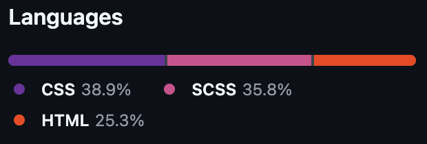

# Text-Animation

# Magic-Navbar-Menu
This project shows an example of text that animates to show different words

## Languages used:

## Showcase:
#### Word 1

#### Word 2

#### Word 3

#### Word 4

#### Normal State

To view and test the live example please click [here](https://andrewh1188.github.io/Text-Animation/)